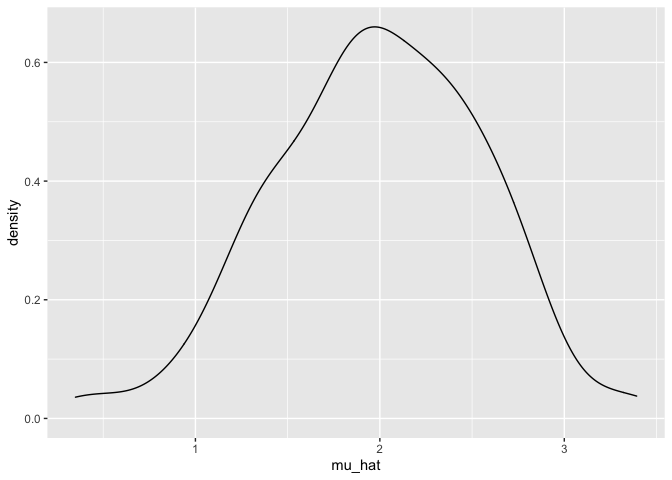
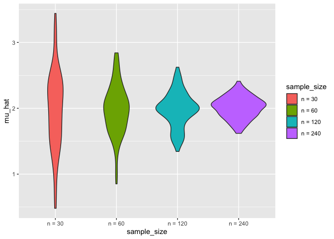

simulation
================

## simulate something

I have a function

``` r
sim_mean_sd = function(n, mu = 2, sigma = 3) { # n = sample_size in lecture
  
  sim_data = tibble(
    x = rnorm(n, mean = mu, sd = sigma),
  )
  
  sim_data %>% 
    summarize(
      mu_hat = mean(x),
      sigma_hat = sd(x)
    )
}
```

I can “simulate” by running this line

``` r
sim_mean_sd(30)
```

    ## # A tibble: 1 × 2
    ##   mu_hat sigma_hat
    ##    <dbl>     <dbl>
    ## 1   2.25      2.77

## let’s simulate a lot

start with for loop

``` r
output = vector("list", 100)

for (i in 1:100) {
  output[[i]] = sim_mean_sd(30)
}

sim_results = bind_rows(output)
```

let’s use a loop function

``` r
sim_results = 
  rerun(100, sim_mean_sd(n = 30)) %>% 
  bind_rows()
```

let’s look at results

``` r
sim_results %>% 
  ggplot(aes(x = mu_hat)) + 
  geom_density()
```

<!-- -->

``` r
sim_results %>% 
  pivot_longer(
    mu_hat:sigma_hat,
    names_to = "parameter", 
    values_to = "estimate") %>% 
  group_by(parameter) %>% 
  summarize(
    emp_mean = mean(estimate),
    emp_sd = sd(estimate)) %>% 
  knitr::kable(digits = 3)
```

| parameter  | emp\_mean | emp\_sd |
|:-----------|----------:|--------:|
| mu\_hat    |     1.985 |   0.567 |
| sigma\_hat |     2.971 |   0.375 |

## let’s try other sample sizes

``` r
n_list = 
  list(
    "n_30"  = 30, 
    "n_60"  = 60, 
    "n_120" = 120, 
    "n_240" = 240)

output = vector("list", length = 4)

for (i in 1:4) {
  output[[i]] = rerun(100, sim_mean_sd(n_list[[i]])) %>% 
    bind_rows
}
```

``` r
sim_results = 
  tibble(sample_size = c(30, 60, 120, 240)) %>% 
  mutate(
    output_lists = map(.x = sample_size, ~rerun(1000, sim_mean_sd(n = .x))),
    estimate_dfs = map(output_lists, bind_rows)) %>% 
  select(-output_lists) %>% 
  unnest(estimate_dfs)
```

``` r
sim_results %>% 
  mutate(
    sample_size = str_c("n = ", sample_size),
    sample_size = fct_inorder(sample_size)) %>% 
  ggplot(aes(x = sample_size, y = mu_hat, fill = sample_size)) + 
  geom_violin()
```

<!-- -->

``` r
sim_results %>% 
  pivot_longer(
    mu_hat:sigma_hat,
    names_to = "parameter", 
    values_to = "estimate") %>% 
  group_by(parameter, sample_size) %>% 
  summarize(
    emp_mean = mean(estimate),
    emp_var = var(estimate)) %>% 
  knitr::kable(digits = 3)
```

    ## `summarise()` has grouped output by 'parameter'. You can override using the `.groups` argument.

| parameter  | sample\_size | emp\_mean | emp\_var |
|:-----------|-------------:|----------:|---------:|
| mu\_hat    |           30 |     1.996 |    0.291 |
| mu\_hat    |           60 |     2.011 |    0.149 |
| mu\_hat    |          120 |     1.990 |    0.079 |
| mu\_hat    |          240 |     2.002 |    0.039 |
| sigma\_hat |           30 |     2.972 |    0.144 |
| sigma\_hat |           60 |     2.998 |    0.077 |
| sigma\_hat |          120 |     2.989 |    0.038 |
| sigma\_hat |          240 |     2.993 |    0.019 |
